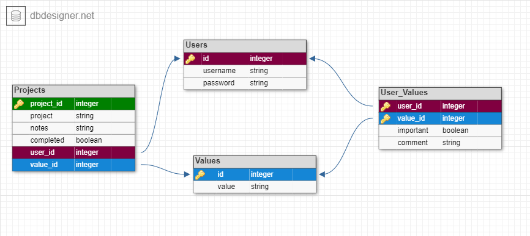

# ESSENTIALISM API

## API Base URL
`https://essentialism-be-api.herokuapp.com/`

#### Server Status
**GET**: `/` </br>
When active, will respond with: 
```
ESSENTIALISM server is alive
```
## Table of Contents

- [Install](#install)
- [Authentication](#authentication)
    - [Register](#register-a-user) (POST)
    - [Login](#login-with-a-registered-user) (POST)
- [Data](#data)
    - [Values](#values) (GET)
- [Protected Data](#protected-data)
    - [User's Values](#users-values) (GET, POST, PUT)
    - [User's Projects](#users-projects) (GET, POST, PUT, DELETE)
- [Database Schema](#database-schema)
- [License](#license)

## Install

```
npm install
```

# Authentication
Authentication expires in: `3 hours`

### Register a user

Usernames *MUST* be unique. </br>
Registering an existing user will give a response:
`{ error: "Username already registered" }`</br></br>
**POST**: `/api/auth/register`
```
{
    "username": "myuser",
    "password": "verysecretpass"
}
```

Will return:
```
{
    "user": {
        "id": int,
        "username": string
    },
    "token": string
}
```

### Login with a registered user
**POST**: `/api/auth/login`
```
{
    "username": "myuser",
    "password": "verysecretpass"
}
```

Will return:
```
{
    "user": {
        "id": int,
        "username": string
    },
    "token": string
}
```

# Data
Data does NOT require Authorization. </br></br>

### Values
**GET**: `/api/values`</br>
Will return an array of values</br>
```
[
    {
    "id": int,
    "value": string
    }
]
```


# Protected Data
Protected Data requires Authorization obtained upon register/login </br>
Authorization must be included in the header of all requests for the below endpoints</br></br>

### User's Values
**GET**: `/api/user/:id/values` </br>
Will return an array of values given a user's ID
```
[
    {
    "id": int,
    "value_id": int,
    "value": string,
    "important": boolean, 
    "comment": string (optional/can be null)
    }
]
```
</br>

**POST**: `/api/user/:id/values` </br>
User Values will be created on login</br>
Default values:
```
{
    "user_id": (same as registered user),
    "important": false,
    "comment": null,
    "value_id": (same as value being referred),
    "top3": false
}
```

</br>

**PUT**: `/api/user/:id/values` </br>
Will take in a single Values object and apply it to the user ID specified in the `:id` portion of the endpoint</br>

```
{
    "value_id": int, (id of the Value),
    "top3": boolean, (if no value is included, db will default to false)
    "important": boolean, (if no value is included, db will default to false)
    "comment": string (optional/can be null)
}
```
Will return:
```
{
    "user_id": int,
    "important": boolean,
    "comment": string || null,
    "value_id": int,
    "top3": boolean
}
```
</br>

**DELETE**: `/api/user/:id/values`</br>
Not setup/not needed at this time

</br></br>
### User's Projects
**GET**: `/api/user/:id/projects` </br>
Will return an array of projects given a user's ID
```
[
    {
    "id": int,
    "project_id": int,
    "project": string,
    "notes": string || null,
    "completed": boolean,
    "value_id": string
    }
]
```
</br>

**POST**: `/api/user/:id/projects` </br>
Will take in a single Projects object and apply it to the user ID specifed in the `:id` portion of the endpoint</br>
```
{
    "value_id": int, (required)
    "project": string, (required)
    "notes": string, (optional/can be null)
    "completed": boolean (optional & default is false)
}
```
</br>
Will return:

```
{
    "user_id": int,
    "project": string,
    "notes": string || null,
    "completed": boolean,
    "project_id": int,
    "value_id": int
}
```
</br>

**PUT**: `/api/user/:id/projects/:project_id` </br>
Will take in a single Projects to update</br>
User id is specified in the `:id` portion of the endpoint</br>
Project id is specified in the `:project_id` portion of the endpoint</br>
```
{
    "value_id": int, (required)
    "project": string, (required)
    "notes": string, (optional/can be null)
    "completed": boolean (optional & default is false)
}
```
</br>
Will return:

```
{
    "user_id": int,
    "project_id": int,
    "project": string,
    "notes": string || null,
    "completed": boolean,
    "value_id": int
}
```
</br>

**DELETE**: `/api/user/projects/:project_id` </br>
_No body is required for DELETE method._</br>
Include the appropriate Project's ID in the endpoint where `:project_id` slug is listed.</br>
Will return:
```
"Successfully deleted project"
            or
"Failed to delete project"
```

### Database Schema



#### License

MIT © 2020 Essentialism
